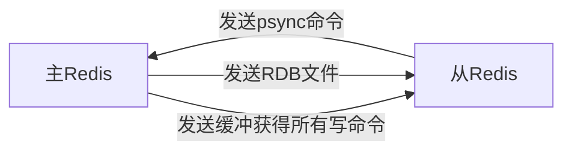
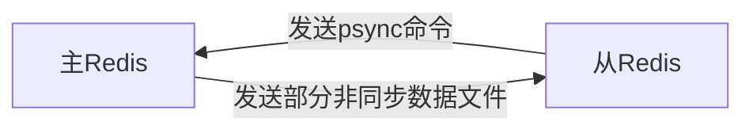

# 什么是Redis
* Redis 是 C 语言开发的一个开源的（遵从 BSD 协议）高性能键值对（key-value）的内存数据库，可以用作数据库、缓存、消息中间件等。
* 它是一种 NoSQL（not-only sql，泛指非关系型数据库）的数据库。（MySQL是一种关系型数据库）
* 性能优秀，数据在内存中，读写速度非常快，支持并发 10W QPS。
* 单进程单线程，是线程安全的，采用 IO 多路复用机制。
* 丰富的数据类型，支持字符串（strings）、散列（hashes）、列表（lists）、集合（sets）、有序集合（sorted sets）等。
* 支持数据持久化。可以将内存中数据保存在磁盘中，重启时加载。
* 主从复制，哨兵，高可用。
* 可以用作分布式锁。
* 可以作为消息中间件使用，支持发布订阅。

# Redis的五种数据类型
## Redis 核心对象 (redisObject)
* 数据类型 type
	* string
		* 可以理解成与 Memcached一模一样的类型，一个 Key 对应一个 Value。Value 不仅是 String，也可以是数字。
		* String 类型是二进制安全的，意思是 Redis 的 String 类型可以包含任何数据，比如 jpg 图片或者序列化的对象。String 类型的值最大能存储 512M。
	* hash
		* Hash是一个键值（key-value）的集合。Redis 的 Hash 是一个 String 的 Key 和 Value 的映射表，Hash 特别适合存储对象。常用命令：hget，hset，hgetall 等。
	* list
		* List 列表是简单的字符串列表，按照插入顺序排序。可以添加一个元素到列表的头部（左边）或者尾部（右边） 常用命令：lpush、rpush、lpop、rpop、lrange（获取列表片段）等。
		* 双向列表
	* set
		* 集合是通过 hashtable 实现的。Set 中的元素是没有顺序的，而且是没有重复的。常用命令：sdd、spop、smembers、sunion 等。
	* sorted list
		* 和 Set 相比，Sorted Set关联了一个 Double 类型权重的参数 Score，使得集合中的元素能够按照 Score 进行有序排列，Redis 正是通过分数来为集合中的成员进行从小到大的排序。
		* Redis Sorted Set 的内部使用 HashMap 和跳跃表（skipList）来保证数据的存储和有序，HashMap 里放的是成员到 Score 的映射。
* 编码方式 encoding
	* raw 
	* int
	* ht
	* zipmap
	* linkedlist
	* ziplist
	* intest
* 数据指针
* 虚拟内存
* 其他


使用**一个** redisObject 对象来表示**所有**的 key 和 value

## 注意事项
type 表示一个 value 对象具体是何种数据类型，encoding 是不同数据类型在 Redis 内部的存储方式。

# Redis缓存

//todo

## Redis雪崩
**举个栗子**：如果首页所有 Key 的失效时间都是 12 小时，中午 12 点刷新的，我零点有个大促活动大量用户涌入，假设每秒 6000 个请求，本来缓存可以抗住每秒 5000 个请求，但是缓存中所有 Key 都失效了。

**解决方案**：在批量往 Redis 存数据的时候，把每个 Key 的失效时间都加个随机值就好了，这样可以保证数据不会再同一时间大面积失效。

## 缓存穿透
缓存穿透是指缓存和数据库中都没有的数据，而用户（黑客）不断发起请求。

**举个栗子**：我们数据库的 id 都是从 1 自增的，如果发起 id=-1 的数据或者 id 特别大不存在的数据，这样的不断攻击导致数据库压力很大，严重会击垮数据库。

**解决方案**

* 缓存穿透我会在接口层增加校验，比如用户鉴权，参数做校验，不合法的校验直接 return，比如 id 做基础校验，id<=0 直接拦截。
* **布隆过滤器**
	* 快速剔除一些不在数据库的值
	* 布隆过滤器是一个 bit 向量或者说 bit 数组，如果我们要映射一个值到布隆过滤器中，我们需要使用多个不同的哈希函数生成多个哈希值，并对每个生成的哈希值指向的 bit 位置 1。
	* 如果查询的时候对应bit是 0，那么可以确定一定不在。但如果都是1，只能说明可能存在。
	* https://zhuanlan.zhihu.com/p/43263751

## 缓存击穿
缓存击穿是指一个 Key 非常热点，在不停地扛着大量的请求，大并发集中对这一个点进行访问，当这个 Key 在失效的瞬间，持续的大并发直接落到了数据库上，就在这个 Key 的点上击穿了缓存。

**解决方案**：设置热点数据永不过期，或者加上互斥锁就搞定了。


# Redis性能分析
Redis 是单进程单线程的模型，因为 Redis 完全是基于内存的操作，CPU 不是 Redis 的瓶颈，Redis 的瓶颈最有可能是机器内存的大小或者网络带宽。
## Redis速度快的原因分析
* Redis 完全基于内存，绝大部分请求是纯粹的内存操作，非常迅速，数据存在内存中，类似于 HashMap，HashMap 的优势就是查找和操作的时间复杂度是 O(1)。

* 数据结构简单，对数据操作也简单。

* 采用单线程，避免了不必要的上下文切换和竞争条件，不存在多线程导致的 CPU 切换，不用去考虑各种锁的问题，不存在加锁释放锁操作，没有死锁问题导致的性能消耗。

* 使用多路复用 IO 模型，非阻塞 IO。//todo

## Redis vs. Memcached
* 存储方式上：Memcache 会把数据全部存在内存之中，断电后会挂掉，数据不能超过内存大小。Redis 有部分数据存在硬盘上，这样能保证数据的持久性。

* 数据支持类型上：Memcache 对数据类型的支持简单，只支持简单的 key-value，，而 Redis 支持五种数据类型。

* 使用底层模型不同：它们之间底层实现方式以及与客户端之间通信的应用协议不一样。Redis 直接自己构建了 VM 机制，因为一般的系统调用系统函数的话，会浪费一定的时间去移动和请求。

* Value 的大小：Redis 可以达到 1GB，而 Memcache 只有 1MB。

## Redis 淘汰策略

|  策略 | 描述 |
| ----  | -------- | 
| volatile-lru | 从已设置过期时间的KV集中优先对最近最少使用的数据 (less recently usesd) 淘汰 | 
| volatile-ttl | 从已设置过期时间的KV集中优先对剩余时间短的数据 (time to live) 淘汰 | 
| volatile-random | 从已设置过期时间的KV集中随机淘汰 | 
| allKeys-lru | 从所有KV集中优先对最近最少使用的数据 (less recently usesd) 淘汰 |
| allKeys-random | 从所有KV集中随机淘汰 | 
| noeviction | 不淘汰，若超过最大内存，返回错误信息 | 

# Redis持久化机制
Redis 为了保证效率，数据缓存在了内存中，但是会周期性的把更新的数据写入磁盘或者把修改操作写入追加的记录文件中，以保证数据的持久化。当 Redis 重启的时候，它会优先使用 AOF 文件来还原数据集，因为 AOF 文件保存的数据集通常比 RDB 文件所保存的数据集更完整。
## AOF (Append Only File)
把所有的对 Redis 的服务器进行修改的**命令**都存到一个文件里，命令的集合。Redis 默认是快照 RDB 的持久化方式。

* 工作方式
	* 使用 AOF 做持久化，每一个写命令都通过 write 函数追加到 appendonly.aof 中

```
 appendfsync yes
 appendfsync always     #每次有数据修改发生时都会写入AOF文件。
 appendfsync everysec   #每秒钟同步一次，该策略为AOF的缺省策略。
```
	
AOF 可以做到全程持久化，只需要在配置中开启 appendonly yes。这样 Redis 每执行一个修改数据的命令，都会把它添加到 AOF 文件中，当 Redis 重启时，将会读取 AOF 文件进行重放，恢复到 Redis 关闭前的最后时刻。

* 优点
	* 让 Redis 变得非常耐久。可以设置不同的 Fsync 策略，AOF的默认策略是每秒钟 Fsync 一次，在这种配置下，就算发生故障停机，也最多丢失一秒钟的数据。

* 缺点
	* 对于相同的数据集来说，AOF 的文件体积通常要大于 RDB 文件的体积。根据所使用的 Fsync 策略，AOF 的速度可能会慢于 RDB。
	
## RDB (Redis Database)
快照形式是直接把内存中的数据保存到一个 dump 的文件中，定时保存，保存策略。

* 工作方式
	*  当 Redis 需要做持久化时，Redis 会 fork 一个子进程，子进程将数据写到磁盘上一个临时 RDB 文件中。
	*  当子进程完成写临时文件后，将原来的 RDB 替换掉，这样的好处是可以 copy-on-write。
* 优点
	* 这种文件非常适合用于备份：比如，你可以在最近的 24 小时内，每小时备份一次，并且在每个月的每一天也备份一个 RDB 文件。RDB 非常适合灾难恢复。
* 缺点
	* 如果你需要尽量避免在服务器故障时丢失数据，那么RDB不合适你。 

如果你非常关心你的数据，但仍然可以承受数分钟内的数据丢失，那么可以额只使用 RDB 持久。AOF 将 Redis 执行的每一条命令追加到磁盘中，处理巨大的写入会降低Redis的性能，不知道你是否可以接受。数据库备份和灾难恢复：定时生成 RDB 快照非常便于进行数据库备份，并且 RDB 恢复数据集的速度也要比 AOF 恢复的速度快。当然了，Redis 支持同时开启 RDB 和 AOF，系统重启后，Redis 会优先使用 AOF 来恢复数据，这样丢失的数据会最少。


# 主从复制
## 整体步骤
* 从节点执行 slaveof[masterIP][masterPort]，保存主节点信息。
* 从节点中的定时任务发现主节点信息，建立和主节点的 Socket 连接。
* 从节点发送 Ping 信号，主节点返回 Pong，两边能互相通信。
* 连接建立后，主节点将所有数据发送给从节点（数据同步）。
* 主节点把当前的数据同步给从节点后，便完成了复制的建立过程。接下来，主节点就会持续的把写命令发送给从节点，保证主从数据一致性。

## 数据同步
### 基本概念
* runId：每个 Redis 节点启动都会生成唯一的 uuid，每次 Redis 重启后，runId 都会发生变化。
* offset：主节点和从节点都各自维护自己的主从复制偏移量 offset，当主节点有写入命令时，offset=offset+命令的字节长度。
从节点在收到主节点发送的命令后，也会增加自己的 offset，并把自己的 offset 发送给主节点。
这样，主节点同时保存自己的 offset 和从节点的 offset，**通过对比 offset 来判断主从节点数据是否一致**。
* repl_backlog_size：保存在主节点上的一个固定长度的先进先出队列，默认大小是 1MB。

## 过程
* Redis 2.8 之前使用 sync[runId][offset] 同步命令，Redis 2.8 之后使用 psync[runId][offset] 命令。
* 两者不同在于，Sync 命令仅支持全量复制过程，Psync 支持全量和部分复制。

## 复制
### 全量复制


* 复制过程：
	* slave 服务启动，slave 会建立和 master 的连接，发送 sync 命令。
	* master 启动一个后台进程将数据库快照保存到 RDB 文件中
		* 注意：此时如果生成 RDB 文件过程中存在写数据操作会导致 RDB 文件和当前主 redis 数据不一致，所以此时 master 主进程会开始收集写命令并缓存起来。
	* master 就发送 RDB 文件给 slave
	* slave 将文件保存到磁盘上，然后加载到内存恢复
	* master 把缓存的命令转发给 slave
		* 注意：后续 master 收到的写命令都会通过开始建立的连接发送给 slave。
	* 当 master 和 slave 的连接断开时 slave 可以自动重新建立连接。如果 master 同时收到多个 slave 发来的同步连接命令，只会启动一个进程来写数据库镜像，然后发送给所有 slave。
* 问题
  
### 部分复制
首次同步


非首次同步


* 复制过程
	* 从机连接主机后，会主动发起 PSYNC 命令，从机会提供 master 的 runid(机器标识，随机生成的一个串) 和 offset（数据偏移量，如果offset主从不一致则说明数据不同步）
	* 主机验证 runid 和 offset 是否有效，runid 相当于主机身份验证码，用来验证从机上一次连接的主机
		* 如果 runid 验证未通过则，则进行全同步，如果验证通过则说明曾经同步过，根据 offset 同步部分数据。

## 参考文献
https://www.kancloud.cn/mayan0718/php/515287

# Sentinel 哨兵机制
## 哨兵机制简介
* Sentinel(哨兵) 进程是用于监控 Redis 集群中 Master 主服务器工作的状态
* 在 Master 主服务器发生故障的时候，可以实现 Master 和 Slave 服务器的切换，保证系统的高可用（High Availability）
* Sentinel 本身没有主从之分，只有 Redis 服务节点有主从之分。

## 哨兵进程的作用
* 监控(Monitoring)：哨兵(sentinel) 会不断地检查你的 Master 和 Slave 是否运作正常。
* 提醒(Notification)：当被监控的某个Redis节点出现问题时, 哨兵(sentinel) 可以通过 API 向管理员或者其他应用程序发送通知。（使用较少）
* 自动故障迁移(Automatic failover)：当一个 Master 不能正常工作时，哨兵(sentinel) 会开始一次自动故障迁移操作。具体操作如下：
	* 它会将失效 Master 的其中一个 Slave 升级为新的 Master, 并让失效 Master 的其他Slave 改为复制新的 Master。
	* 当客户端试图连接失效的 Master 时，集群也会向客户端返回新 Master 的地址，使得集群可以使用现在的 Master 替换失效 Master。
	* Master 和 Slave 服务器切换后，Master 的 redis.conf、Slave 的 redis.conf 和sentinel.conf 的配置文件的内容都会发生相应的改变，即 Master 主服务器的 redis.conf 配置文件中会多一行 slaveof 的配置，sentinel.conf 的监控目标会随之调换。

## 哨兵的工作方式
* **每个** Sentinel（哨兵）进程以**每秒钟一次**的频率向整个集群中的**Master主服务器，Slave 从服务器以及其他 Sentinel（哨兵）进程**发送一个 PING 命令。
* 如果一个实例（instance）距离最后一次有效回复 PING 命令的时间超过 down-after-milliseconds 选项所指定的值， 则这个实例会被 Sentinel（哨兵）进程标记为**主观下线（SDOWN）**。
* 如果一个 Master 主服务器被标记为主观下线（SDOWN），则正在监视这个 Master 主服务器的所有 Sentinel（哨兵）进程要以每秒一次的频率确认 Master 主服务器的确进入了主观下线状态。
* 当有足够数量的 Sentinel（哨兵）进程（大于等于配置文件指定的值）在指定的时间范围内确认 Master 主服务器进入了主观下线状态（SDOWN）， 则 Master 主服务器会被标记为**客观下线（ODOWN）**。
* 在一般情况下， 每个 Sentinel（哨兵）进程会以每 10 秒一次的频率向集群中的所有Master 主服务器、Slave 从服务器发送 INFO 命令。
* 当 Master 主服务器被 Sentinel（哨兵）进程标记为**客观下线（ODOWN）**时，Sentinel（哨兵）进程向下线的 Master 主服务器的所有 Slave 从服务器发送 INFO 命令的频率会从 10 秒一次改为每秒一次。
* 若没有足够数量的 Sentinel（哨兵）进程同意 Master 主服务器下线， Master 主服务器的**客观下线**状态就会被移除。若 Master 主服务器重新向 Sentinel（哨兵）进程发送 PING 命令返回有效回复，Master 主服务器的主观下线状态就会被移除。

* 

## 参考文献
https://zhuanlan.zhihu.com/p/44474652


